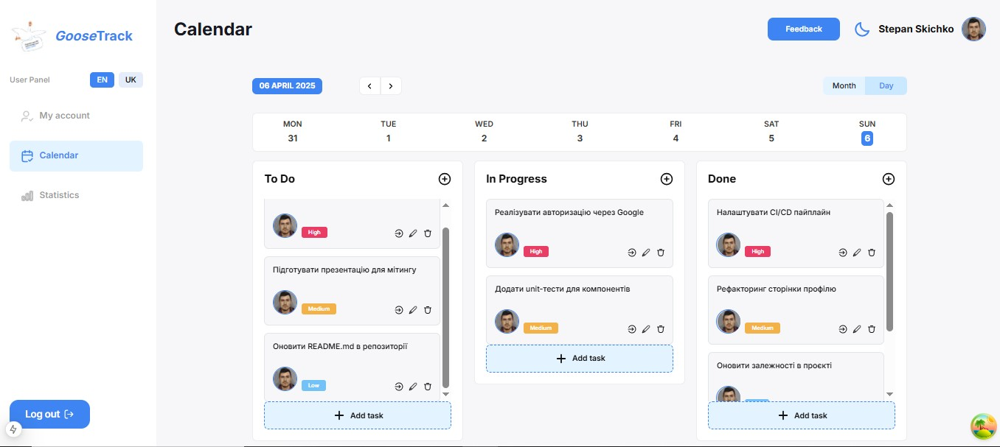

# Goosetrack

**[LIVE PAGE](https://goosetrack-nextjs.vercel.app/en)**



<p align="center">
  <a href="#introduction">Introduction</a> •
  <a href="#features">Features</a> •
  <a href="#components-api">Components API</a> •
  <a href="#credits">Credits</a> •
  <a href="#getting-started">Getting started</a>
</p>

<!-- ## Features
- Створено наступні маршрути:
  - загальнодоступні /en, /en/register, /en/login, /en/not-found
  - захищені маршрути /en/calendar, /en/statistics, /en/account
- Реалізовано інтернаціоналізацію веб додатку для двох мов - англійська та українська
- Реалізовано функціонал світлої/темної теми.

- Головна сторінка представлена статичними секціями і тут є можливість перейти до авторизації, почитати відомості про додаток а також подивитись відгуки зареєстрованих користувачів. Відгуки реалізовані слейдером і поки підтягуються дані з бази даних то видно лоадер.

- При реєстрації перевіряється наявність користувача з вказаною поштою в базі даних. При успішній реєстрації, дані записуються в базу даних, користувач бачить повідомлення про успіх реєстрації і його перенаправляють на сторінку для авторизації
- При авторизації (логіні), якщо користувача з вказаними поштою і паролем знайдено, то його перенаправляють на захищений маршрут /en/calendar/month/:currentDate. Також відразу генерується унікальний токен і записується в кукі.
- Для неавторизованого користувача заблоковано доступ на захищені маршрути шляхом перевірки наявності токена в кукі.

Захищені маршрути /en/calendar, /en/statistics, /en/account мають спільний лейаут.
  - Присутній сайдбар на якому можна переходити між сторінками, змінити мову в додатку і вийти з аккаунту. Для малих екранів реалізовано як бургер меню, для великих екранів - сайдбар статичний.
  - Присутній хедер який відображає імя користувача, його аватар, кнопку зміни теми оформлення, кнопку відкриття модалки для створення/редагування відгуку.
    - В хедері на сторінці /en/calendar/day/:currentDate при наявності завдань в розділі to do - присутній мотиваційний гусак із закликом до дій.
- Вихід з аккаунта автоматично перенаправляє на головну сторінку

- Сторінка /account: представлена формою де підтягуються дані з бази даних і в доповнення до даних що були введені при реєстрації можна також додати номер телефон, дату народження, телеграм нікнейм та змінити аватар. Кнопка сабміту неактивна у разі відсутності будь яких змін у даних користувача.

- Сторінка календаря /calendar є динамічним маршрутом і в залежності від обраного типу відображення день/місяць може показувати два маршрути /calendar/month/:currentDate та /calendar/day/:currentDate
  - /calendar/month/:currentDate є початковою сторінкою і відображає повний календар поточного місяця. в кожній клітинця певного дня за наявності підтягуються завдання. При виборі будь якої дати можна перейти на сторінку обрангого дня і подивитись завдання.
  - /calendar/day/:currentDate являє собою тижневий календар з переліком завдань розбитих на 3 колонки. На мобільній і планшетній версії колонки з завданнями реалізовані через слайдер. Тут можна створити/редагувати/видалити завдання. Також можливо змінювати категорію завдань.

  - Сторінка статистики /statistics представляє собою діаграму де можна побачити співвідношення між категоріями завдань за певний місяць.
-->

## ✨ Features

<details>
  <summary><strong>Explore the list of key features below:
</strong></summary>

---

<details>
  <summary><strong>🌐 Routes & Internationalization
</strong></summary>
  
- **Public Routes**:  
  `/en`, `/en/register`, `/en/login`, `/en/not-found`

- **Protected Routes**:  
  `/en/calendar`, `/en/statistics`, `/en/account`

- **Internationalization (i18n)**:  
  Fully implemented for two languages — **English** and **Ukrainian**

- **Light/Dark Theme Support**:  
 Full support for switching between themes
</details>

---

<details>
  <summary><strong>🏠 Landing Page
</strong></summary>

- Built with static sections
- Allows users to:
  - **Sign in / Register**
  - **Read app information**
  - **View users feedback**
- Reviews section includes a **slider**
- Displays a **loader** while fetching data from the database
</details>

---

<details>
  <summary><strong> 🔐 Authentication Flow
</strong></summary>

#### ✅ Registration

- Checks if the user already exists by email
- On success:
  - Saves user data to the database
  - Shows success notification
  - Redirects to the login page

#### 🔑 Login

- Verifies credentials (email and password)
- On success:
  - Redirects to `/en/calendar/month/:currentDate`
  - Generates a unique **token** stored in **cookies**
  </details>

---

<details>
  <summary><strong>🧭 Protected Layout Structure
</strong></summary>

#### 🛡️ Route Protection

- Protected routes are accessible only if a valid token is found in cookies
- Unauthorized users are blocked from access

All protected routes share a unified layout:

#### 📚 Sidebar Navigation

- Links to:
  - `/calendar`
  - `/statistics`
  - `/account`
- Includes:
  - **Language switcher**
  - **Logout button**
- Responsive behavior:
  - **Sidebar** for large screens
  - **Burger menu** for small screens

#### 🧑‍💼 Header

- Displays:
  - User’s **name**
  - User **avatar**
  - **Theme toggle**
  - Button to open modal for feedback creation/editing
- On route `/en/calendar/day/:currentDate`:
  - If `to do` tasks are present, a **motivational goose** is shown

### 🚪 Logout Behavior

- Logging out automatically **redirects** the user to the landing page

</details>

---

<details>
  <summary><strong>👤 Account Page
</strong></summary>

- Includes a form with data fetched from the database
- Extends registration data with optional fields:
  - Phone number
  - Date of birth
  - Telegram username
  - Avatar change
- **Submit button is disabled** unless there are changes in the form

</details>

---

<details>
  <summary><strong>🗓 Calendar Page
</strong></summary>

#### `/calendar/month/:currentDate`

- Default starting view
- Displays a full month view
- Each day cell shows tasks if available
- Clickable dates navigate to their corresponding **day view**

#### `/calendar/day/:currentDate`

- Weekly task view with 3 columns:
  - **To do**
  - **In progress**
  - **Done**
- On mobile/tablet:
  - Columns are swipeable via **slider**
- Users can:
  - Create, edit, delete tasks
  - Change task categories

</details>

---

<details>
  <summary><strong>📊 Statistics Page
</strong></summary>

- Displays a **diagram** visualizing task distribution across categories
- Filtered by **selected month**

</details>

---

</details>

## Components API

<details>
  <summary><strong>Here you may find a list with the most common components:
</strong></summary>

- #### AuthForm

| Prop   | Value              | Description         |
| ------ | ------------------ | ------------------- |
| `type` | `signUp` / `logIn` | required, form type |

- #### BurgerMenu

| Prop      | Value      | Description                |
| --------- | ---------- | -------------------------- |
| `isOpen`  | `boolean`  | required, set open state   |
| `onClose` | `function` | required, close BurgerMenu |

- #### CalendarToolbar

| Prop             | Value           | Description                  |
| ---------------- | --------------- | ---------------------------- |
| `currentDate`    | `string`        | required, current date       |
| `periodType`     | `day` / `month` | required, period type        |
| `onDateChange`   | `function`      | required, change date func   |
| `onPeriodChange` | `function`      | required, change period func |

- #### ChoosedDay

| Prop           | Value      | Description                |
| -------------- | ---------- | -------------------------- |
| `selectedDate` | `string`   | required, selected date    |
| `onDateChange` | `function` | required, change date func |

- #### ChoosedMonth

| Prop           | Value    | Description             |
| -------------- | -------- | ----------------------- |
| `selectedDate` | `string` | required, selected date |

- #### FeedbackForm

| Prop              | Value                     | Description                  |
| ----------------- | ------------------------- | ---------------------------- |
| `onClose`         | `function`                | required, close modal window |
| `review`          | `IReview[]` / `undefined` | required, review data        |
| `isReviewLoading` | `boolean`                 | required, set skeleton state |

- #### Header

| Prop       | Value      | Description             |
| ---------- | ---------- | ----------------------- |
| `pageName` | `string`   | required, set page name |
| `onOpen`   | `function` | optional, open feedback |

- #### ReviewSlider

| Prop      | Value       | Description            |
| --------- | ----------- | ---------------------- |
| `reviews` | `IReview[]` | required, reviews data |

- #### SideBar

| Prop           | Value      | Description                   |
| -------------- | ---------- | ----------------------------- |
| `onClose`      | `function` | optional, close menu func     |
| `isBurgerMenu` | `boolean`  | optional, set specific styles |

- #### StatisticsChart

| Prop           | Value    | Description             |
| -------------- | -------- | ----------------------- |
| `tasks`        | `Task[]` | required, tasks data    |
| `selectedDate` | `string` | required, selected date |

- #### TaskForm

| Prop           | Value                            | Description                  |
| -------------- | -------------------------------- | ---------------------------- |
| `initialData`  | `object`                         | optional, task data          |
| `onClose`      | `function`                       | required, close modal window |
| `category`     | `To Do` / `In Progress` / `Done` | required, set task category  |
| `selectedDate` | `string`                         | required, selected date      |

- #### AddFeedbackBtn

| Prop     | Value      | Description                 |
| -------- | ---------- | --------------------------- |
| `onOpen` | `function` | required, open modal window |

- #### Avatar

| Prop        | Value    | Description           |
| ----------- | -------- | --------------------- |
| `avatarURL` | `string` | optional, avatar url  |
| `name`      | `string` | optional, username    |
| `size`      | `number` | optional, avatar size |

- #### CalendarTable

| Prop          | Value    | Description            |
| ------------- | -------- | ---------------------- |
| `currentDate` | `string` | required, current date |

- #### DayCalendarHead

| Prop           | Value      | Description                |
| -------------- | ---------- | -------------------------- |
| `weekDays`     | `Date[]`   | required, days of the week |
| `selectedDate` | `string`   | required, selected date    |
| `onDateChange` | `function` | required, change date func |

- #### Modal

| Prop         | Value       | Description                   |
| ------------ | ----------- | ----------------------------- |
| `isOpen`     | `boolean`   | required, set open statet     |
| `onClose`    | `function`  | required, close modal window  |
| `children`   | `ReactNode` | required, react node          |
| `isFeedback` | `boolean`   | optional, set specific styles |

- #### PeriodPaginator

| Prop           | Value           | Description                |
| -------------- | --------------- | -------------------------- |
| `periodType`   | `day` / `month` | required, period type      |
| `selectedDate` | `string`        | required, selected date    |
| `onDateChange` | `function`      | required, change date func |

- #### PeriodTypeSelect

| Prop           | Value           | Description                |
| -------------- | --------------- | -------------------------- |
| `periodType`   | `day` / `month` | required, period type      |
| `onDateChange` | `function`      | required, change date func |

- #### QueryProvider

| Prop       | Value       | Description          |
| ---------- | ----------- | -------------------- |
| `children` | `ReactNode` | required, react node |

- #### ReviewSliderCard

| Prop   | Value     | Description           |
| ------ | --------- | --------------------- |
| `data` | `IReview` | required, review data |

- #### TasksColumnsList

| Prop           | Value    | Description             |
| -------------- | -------- | ----------------------- |
| `selectedDate` | `string` | required, selected date |

- #### TasksColumn

| Prop           | Value                            | Description             |
| -------------- | -------------------------------- | ----------------------- |
| `title`        | `To Do` / `In Progress` / `Done` | required, task category |
| `selectedDate` | `string`                         | required, selected date |
| `tasks`        | `ITask[]`                        | required, tasks data    |

- #### AddTaskBtn

| Prop     | Value      | Description                 |
| -------- | ---------- | --------------------------- |
| `onOpen` | `function` | required, open modal window |

- #### ColumnHeadBar

| Prop        | Value                            | Description                   |
| ----------- | -------------------------------- | ----------------------------- |
| `title`     | `To Do` / `In Progress` / `Done` | required, task category       |
| `onOpen`    | `function`                       | required, open modal window   |
| `className` | `string`                         | optional, set specific styles |

- #### ColumnsTasksList

| Prop        | Value     | Description          |
| ----------- | --------- | -------------------- |
| `tasks`     | `ITask[]` | required, tasks data |
| `maxHeight` | `string`  | required, set height |

- #### TaskColumnCard

| Prop   | Value   | Description         |
| ------ | ------- | ------------------- |
| `task` | `ITask` | required, task data |

- #### TaskToolbar

| Prop       | Value                            | Description                 |
| ---------- | -------------------------------- | --------------------------- |
| `taskId`   | `string`                         | required, task id           |
| `category` | `To Do` / `In Progress` / `Done` | required, task category     |
| `onOpen`   | `function`                       | required, open modal window |

- #### UserNav

| Prop      | Value      | Description                 |
| --------- | ---------- | --------------------------- |
| `onClose` | `function` | optional, close burger menu |

</details>

## Credits

<details>
  <summary><strong>This software uses the following open source packages:
</strong></summary>

| 🧩 General                                    | 🎨 Frontend                                                                          | 🛠️ Backend                                                                    |
| --------------------------------------------- | ------------------------------------------------------------------------------------ | ----------------------------------------------------------------------------- |
| [Next.js](https://nextjs.org/)                | [date-fns](https://www.npmjs.com/package/date-fns)                                   | [bcrypt](https://www.npmjs.com/package/bcrypt)                                |
| [TypeScript](https://www.typescriptlang.org/) | [Tailwindcss](https://tailwindcss.com/)                                              | [cloudinary](https://cloudinary.com/documentation/solution_overview#security) |
| [axios](https://www.npmjs.com/package/axios)  | [HeadlessUI](https://headlessui.com/)                                                | [mongoose](https://www.npmjs.com/package/mongoose)                            |
|                                               | [Swiper](https://swiperjs.com/)                                                      | [jsonwebtoken](https://www.npmjs.com/package/jsonwebtoken)                    |
|                                               | [next-intl](https://next-intl.dev/)                                                  |                                                                               |
|                                               | [next-themes](https://www.npmjs.com/package/next-themes)                             |                                                                               |
|                                               | [react-hook-form](https://react-hook-form.com/)                                      |
|                                               | [resize-observer-polyfills](https://www.npmjs.com/package/resize-observer-polyfills) |
|                                               | [react-loading-skeleton](https://www.npmjs.com/package/react-loading-skeleton)       |                                                                               |
|                                               | [react-number-format](https://www.npmjs.com/package/react-number-format)             |                                                                               |
|                                               | [react-spinners](https://www.npmjs.com/package/react-spinners)                       |                                                                               |
|                                               | [react-stars](https://www.npmjs.com/package/react-stars)                             |                                                                               |
|                                               | [react-toastify](https://www.npmjs.com/package/react-toastify)                       |                                                                               |
|                                               | [recharts](https://www.npmjs.com/package/recharts)                                   |                                                                               |
|                                               | [svgr](https://www.npmjs.com/package/@svgr/webpack)                                  |                                                                               |
|                                               | [zustand](https://www.npmjs.com/package/zustand)                                     |                                                                               |
|                                               | [tanstack/react-query](https://tanstack.com/query/latest)                            |                                                                               |
|                                               | [classnames](https://www.npmjs.com/package/classnames)                               |                                                                               |

</details>

## Getting Started

<details>
  <summary><strong>Let's start:</strong></summary>

- **Clone the repository to local machine**

```bash
https://github.com/iSteffan/goosetrack-nextjs.git
```

- **Install dependencies** via npm:

```
npm install
```

- **Run the project in local environment**

```
npm run dev
```

Open [http://localhost:3000](http://localhost:3000).

</details>
